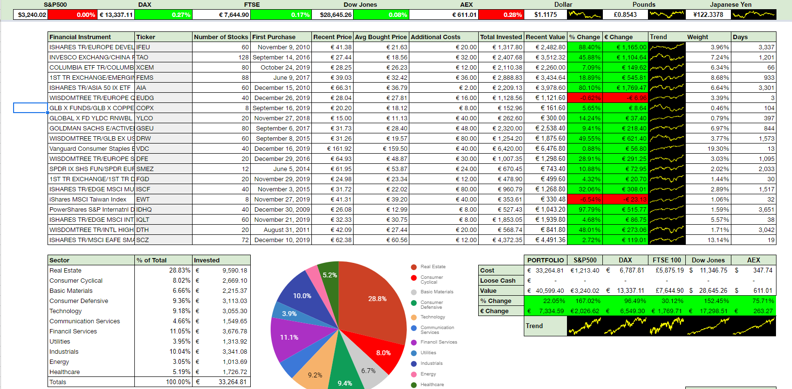

# The Passive Investor

Theories and research about the stock market have stated that the semi-strong form of market efficiency seems to hold. This means that all public information is accurately reflected in the price of an financial instrument. This makes the job of a portfolio manager primarily managing the desired risk appetite of the client and not explicitly trying to outperform the market. This fact in combination with Finance professionals all around the world looking for that 'edge' to make their investment decisions as profitable as possible, makes it so the average joe can not compete.

Therefore, the term 'Passive Investing' is often coined around. This often refers to buying funds (either ETFs or Mutual Funds) that follow the index (i.e. S&P 500, Dow Jones Index) or a broad market (Developed Markets, MSCI World) for diversification benefits. This means that a sudden decrease in performance of one stock within the index does not (on average) lead to a significant decline in the index as a whole. This allows the holder to spend limited time monitoring his holdings, therefore the term 'Passive'.

With a large increase in ETFs available (over 5,000 in 2020), it can become difficult to make the best choice in what you wish to invest. There are many different providers (iShares, Vanguard, Invesco) as well as with changes to the underlying stocks (i.e. High Yield, Super Dividends, Equal Weighted). This is quickly reflected when looking for a S&P 500 ETF as there are over 20 different ETFs available.

With this program and the accompanying spreadsheet, I wish to make investment decisions easier to make and manage.

## Set-Up / Installation (TL;DR)
Installing the program and running an analysis:

1. Download the most recent release [here](https://github.com/JerBouma/ThePassiveInvestor/releases).
    * If you have Python you can also download the folder 'ThePassiveInvestor' and run program.py.
2. Use the Yahoo Finance Screener ([ETFs](https://finance.yahoo.com/screener/etf/new) or [Mutual Funds](https://finance.yahoo.com/screener/mutualfund/new))
    * You can also use 'Quote Lookup' ([example](https://finance.yahoo.com/lookup/etf?s=developed%20markets))
    * You can also use an Excel file that has the tickers listed vertically.
3. Open the program, enter your save location (i.e. C:/Documents/Investing/DevelopedMarketsETF.xlsx) and input the URL or Excelfile you decided to use in Step 2.
4. Run the program, this takes less than a minute to complete.
5. Analyse the Excelfile created

If you have made an investment decisions, you can now use the Spreadsheet:

1. Download your own version [here](https://docs.google.com/spreadsheets/d/1BeJzpVVjJC8CGL-VAbSmvbZX9a3ws34-JlOijvm_sWQ/edit?usp=sharing) (File > Make a copy)
1. Enter your order on the Orderdata tab
2. The Ticker can now be entered on the Portfolio tab
3. Copy the Sector Holdings Mix (as found in the Excelfile created by the Program) to the Sector Holdings tab.
4. Enter the ticker on the Portfolio tab to be able to monitor your holdings adequately.

In case you wish to use the Mobile View tab to monitor your investments on your phone:

1. File > Publish to the Web > Only Mobile View tab
2. Copy and bookmark the link obtained
3. Open the link on your mobile phone
    * Recommended: in Chrome, select 'Add to Chromescreen' for easy access
4. Expand columns accordingly to fill the screen
    * See example [on my phone](Images/exampleMobileView.png) or [live version](https://docs.google.com/spreadsheets/d/e/2PACX-1vRvMw6lNGjzWJSyM7wr1kXUiaix_rBA2GA35MsZ_g91hHVXmyvR932az0SwmhmTDCjc1Pb7Mxqi-X-s/pubhtml?gid=1365265627&single=true)

## Functionality
In this section a brief overview and instruction is given on the program as well as the spreadsheet.

### The Program
The program is able to output an overview of each fund on a seperate sheet. In this overview the following data is shown:
* The title of the fund
* A summary about the fund's purpose/goal
* Sector Holdings (% in each sector)
* Company Holdings (top 10 companies with highest %)
* Risk Statistics (several measures of risk)
    * Displayed in 3, 5 and 10 years
    * Alpha
    * Beta
    * Mean Annual Return
    * R Squared
    * Standard Deviation
    * Sharpe Ratio
    * Treynor Ratio
* Characteristics of the instrument
    * Inception date (start of fund)
    * Category
    * Total assets
    * Currency
    * Net Asset Value
    * Latest close price
* Morningstar Style Box (style of the fund)
* Last five annual returns
* Graph depicting the adjusted close prices over the last 10 years

The input should either be an Excel File (with solely tickers in it) or via Yahoo Finance's ETF or Mutual Fund Screener (see [here](https://finance.yahoo.com/screener/etf/new) and [here](https://finance.yahoo.com/screener/mutualfund/new)). Note that the program <i>can not</i> handle stocks, bonds or anything else that is not a fund. This is because the data used is only available for funds and equity investing is not considered Passive Investing. 

An example of the output can be found in the GIF below. This depicts several ETFs collected from [the Top ETFs according to Yahoo Finance](https://finance.yahoo.com/etfs). 

### The Spreadsheet 
The spreadsheet allow you to input your investment choices and track them accordingly. It uses data as input from what the program creates, but can also be used independently. It features the following.

* Portfolio Tab
    * Display information about  (all continiously updating):
        * Amount bought
        * Purchase date
        * Recent price
        * Bought price
        * Additional costs
        * Total invested
        * Recent value
        * Return (in % and €)
        * YTD trendline
        * Weight in the portfolio
        * Days
    * Recent changes in value of the Indices and Currency exchanges and their trends
    * Comparison between portfolio and indices as benchmarks
    * Accurate input on diversification 
* Orderbook Tab
    * Accurate tracking of orders made that are aggregated on the Portfolio tab
    * Allows the Portfolio Tab not to become cluttered when you invest frequently in the same fund
* Sector Holdings tab
    * Is used to accurately depict the diversification displayed on the portfolio tab
    * Data can be obtained from the output from the program's created excelfile
    * Modifications on a hidden tab are made to correctly weight the diversification (based on amount bought)
* Mobile View tab
    * Created to be bookmarked to quickly track holdings on a mobile phone
    * Requires the tab to be 'Published to the Web' and then bookmarked. Columns can be shifted to match screensize.

To see a live example and to obtain an empty copy see below:
* [Live example](https://docs.google.com/spreadsheets/d/1Ssb8hRVdwR3vLl8VascSOt3VrFhXec967phnrw9t8Do/edit?usp=sharing)
* [Empty version](https://docs.google.com/spreadsheets/d/1BeJzpVVjJC8CGL-VAbSmvbZX9a3ws34-JlOijvm_sWQ/edit?usp=sharing)

You can create a copy of the empty version for personal use.

An example of the Portfolio tab can be found below:

## Contribution
Projects are bound to have (small) errors and can always be improved. Therefore, I highly encourage you to submit issues and create pull requests to improve the program and/or the spreadsheet.

## Disclaimer
While the program allows you to make financial decisions more easily, it explicitely <i>does not</i> make the decisions for you. Therefore, these decisions remain your own and I am not responsible for any losses (or gains) made.